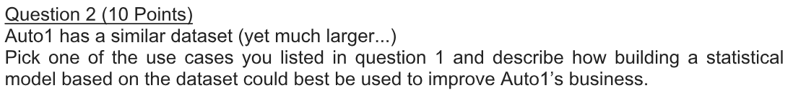
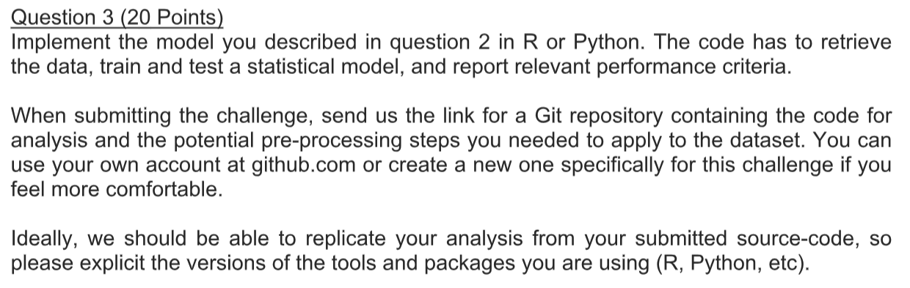
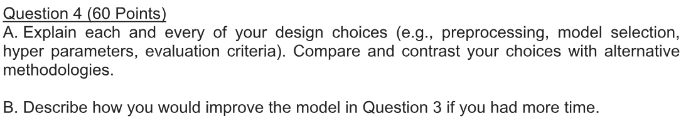

```{r setup, include = FALSE}
knitr::opts_chunk$set(echo = TRUE, warning = FALSE)

Sys.setenv(LANG = "en")

library(dplyr)
library(DT)
library(rpart)

set.seed(8)
```

<font color="#0000A0">

<br>

## Business and problem understanding

AUTO1 is a company that facilitates the process of selling and buying used cars with reliability for both sides (seller and buyer). The process is based on a bidding system, and the problem proposed is to work on a dataset containing information about unlabeled cars with some characteristics on the dataset (as shown on the next section).

The process is ilustrated below.


<br>

## Dataset analysis

First, we import the dataset from the ".csv" file, because R can't handle hyphen in column names it automatically changes to dots.

<br>

```{r}

# import dataset
fullDataset <- read.csv2("database/Auto1-DS-TestData.csv", sep = ",")

# display all column names
colnames(fullDataset)

```

<br>

As informed by the problem, features information (meaning and feature domain) and other attributes are shown at: https://archive.ics.uci.edu/ml/datasets/Automobile

The information can be divided as:

1. Characteristics of the car ('make', 'fuel-type', 'aspiration', 'num-of-doors', etc)
2. Insurance risk rating ('symboling')
3. Normalized losses in use as compared to other cars ('normalized-losses')

The metadata is very complete, although If I could, I would ask two things about the dataset that, at least for me, wasn't clear:

* What is the classification feature used to normalize the relative average loss payment per insured vehicle year?
* If it is normalized, then why doesn't it has a domain from 0 to 1 (assuming the normalize function is the one written below)?

$$ NORM(x_i) = \frac{ (x_i - min(x)) } { max(x) - min(x) }$$

Now, to understand more about the data and start answering the challenge's questions, let's explore the dataset.

<br>

```{r}

# analyze if the columns are or are not factors
data.frame(IS_FACTOR = sapply(fullDataset, function(x) sum(is.factor(x)))) %>% 
  datatable(colnames = c('Features', 'Is a factor?'), options = list(pageLength = 5))

#SRG: showing only factors
data.frame(IS_FACTOR = sapply(fullDataset, function(x) sum(is.factor(x)))) %>% 
  subset(IS_FACTOR == 1) %>% 
  datatable(colnames = c('Features', 'Is a factor?'), options = list(pageLength = 5))

# exploratory analysis of dataset
summary(fullDataset)

```

<br>

We can see above that many columns are defined as factors and there are some "?" representing missing values. So we treat these cases like that:

* For numeric columns replace the NA values to the average of the respective column
* For character columns replace the NA values to the 'MISSING' value

<br>

```{r}

# replace '?' symbol for NA value (NA = 'non available' type in R language)
fullDataset[fullDataset == '?'] <- NA

# convert numeric columns to numeric type (from factor to character and then to numeric)
numericColumns <- c("symboling", "normalized.losses", "wheel.base", "length", "width", "height", "curb.weight", "engine.size", "bore", "stroke", "compression.ratio", "horsepower" ,"peak.rpm" , "city.mpg", "highway.mpg", "price")
fullDataset[, numericColumns] <- data.frame(lapply(fullDataset[, numericColumns],
                                                   function(x) as.numeric(as.character(x))))

# for numeric columns replace NA value with the respective mean
NA2mean <- function(x) ifelse(is.na(x), mean(x, na.rm = TRUE), x)
fullDataset[, numericColumns] <- lapply(fullDataset[, numericColumns], NA2mean)

# convert character columns to character type (from factor to character)
characterColumns <- colnames(fullDataset)[which(!colnames(fullDataset) %in% numericColumns)]
fullDataset[, characterColumns] <- data.frame(lapply(fullDataset[, characterColumns],
                                                     function(x) as.character(x)), stringsAsFactors = FALSE)

# for character columns replace NA value with 'MISSING' value
NA2missing <- function(x) ifelse(is.na(x), 'MISSING', x)
fullDataset[] <- lapply(fullDataset, NA2missing)

# analyze how many not available data are in the dataset columns
sapply(fullDataset, function(x) sum(is.na(x)))

```

<br>

After that, we analyze the frequencies of price and symboling - shown below.

<br>

```{r}

# visualize the distribution for the price feature
hist(fullDataset$price,
     main = 'Histogram of feature price',
     xlab = 'price',
     col = 'blue')

# analyze risk rating frequency
fullDataset %>% 
  select(symboling) %>% 
  group_by(symboling) %>% 
  summarize(quantity = n(),
            frequency = n()/nrow(fullDataset)) %>% 
  datatable(colnames = c('Symboling', 'Quantity', 'Frequency'), rownames = FALSE) %>% 
  formatPercentage(columns = c('frequency'), digits = 2)

```

<br>

From the data and the metadata we can infer that:

* Cars are concentrated at low values (below 10,000)
* Cars are concentrated at medium insurance risk rating 
* It's clear that some features can be used as continuous and some as categorical

<br>

## Challenge questions


<br>

We might use this dataset for these situations (models and data analysis):

* Identify the profile of the cars in the dataset (average price, average size in different ways, most frequent make, etc), this can help the marketing team and other areas in the company
* Model the price of new vehicles added to the plataform
* Model the possible losses of new vehicles added to the plataform
* Complete the missing information of the dataset using other features, for example: missing information for the num-of-doors feature of a registered vehicle, we could create a model using other informations (make, fuel-type, drive-wheels, etc) to predict the number of doors of this vehicle (although it's not very common, it can be done)

<br>



<br>

I registered myself at AUTO1 website on the purpose of understanding more about the business model (haven't uploaded any company documents). I imagine that in some part of the process the company measure the insurance risk and the relative average loss payment to prevent itself during the process (buying and selling).

I concluded that the price (initial binding purchase price) is defined by AUTO1, thus, I think that creating a model that preciselly predict this price would improve company's result, as the loss could be lower and the price fittest to reality.

<br>



<br>

I'll create a model for the price of the vehicles, as the target variable is a continuous variable I'll use a regression model. Therefore, first I created the training dataset and the test dataset by selecting randomly from the full dataset.

Normally I would separate data in three different datasets: training, validation and test, with the proportion of 50%, 25% and 25%, respectively. However, because the dataset doesn't have too many observations, I used only training and test datasets with the proportion of 75% and 25%, respectively.

<br>

```{r}

# create index for sampling the datasets
trainingSize <- floor(0.75 * nrow(fullDataset))
trainingIndex <- sample(seq_len(nrow(fullDataset)), size = trainingSize)

# create datasets for training and test
trainingDF <- fullDataset[trainingIndex, ]
testDF <- fullDataset[-trainingIndex, ]

```

<br>

Because it is a small dataset, it doesn't make sense looking for complex models and I should start applying a simple model for the problem, for example, a regression tree.

<br>

```{r}

# regression tree
model <- rpart(price ~ symboling + normalized.losses + make + fuel.type + aspiration + num.of.doors + body.style + drive.wheels + engine.location + wheel.base + length + width + height + curb.weight + engine.type + num.of.cylinders + engine.size + fuel.system + bore + stroke + compression.ratio + horsepower + peak.rpm + city.mpg + highway.mpg,
               data = trainingDF,
               method = "anova")

# print model characteristics
printcp(model)

```

<br>

In the end, the algorithm used only three features (curb.weight, engine.size and make). To make it more visual I plotted the tree disposition below.

<br>

```{r}

# plot tree disposition
plot(model, uniform = TRUE, main = "Regression Tree")
text(model, use.n = TRUE, all = TRUE, cex = .8)

```

<br>

Thus, we analyze the model performance in the training and test dataset by R2 (the closer to 100% the better the model) and RMSE given by:

$$ R^{2} = 1 - \frac{ \sum_{i=1}^{n} (y_i - \hat{y}_i)^2 } { \sum_{i=1}^{n} (y_i - \bar{y})^2 }$$

<br>

$$ RMSE = \sqrt \frac{ \sum_{i=1}^{n} (y_i - \hat{y}_i)^2 } { n }$$

<br>

```{r}

testDF <- testDF %>%
            filter(fuel.system != 'spfi')

# apply the model into the training and test dataset
predicttrainingDF <- data.frame(PRED_REG_TREE = predict(model, trainingDF))
predictTestDF <- data.frame(PRED_REG_TREE = predict(model, testDF))

# aggregate the predicted columns into the training and test datasets
trainingDF <- bind_cols(trainingDF, predicttrainingDF)
testDF <- bind_cols(testDF, predictTestDF)

# performance tests
datasetsLabel = c('Training', 'Test')

R2 = c(1 - (sum((trainingDF$price - trainingDF$PRED_REG_TREE) ^ 2, na.rm = TRUE) / sum((trainingDF$price - mean(trainingDF$price, na.rm = TRUE)) ^ 2, na.rm = TRUE)),
       1 - (sum((testDF$price - testDF$PRED_REG_TREE) ^ 2, na.rm = TRUE) / sum((testDF$price - mean(testDF$price, na.rm = TRUE)) ^ 2, na.rm = TRUE)))

RMSE = c(sqrt(mean((trainingDF$PRED_REG_TREE - trainingDF$price) ^ 2, na.rm = TRUE)),
         sqrt(mean((testDF$PRED_REG_TREE - testDF$price) ^ 2, na.rm = TRUE)))

# exhibit table with performances
data.frame(datasetsLabel, R2, RMSE) %>% 
  datatable(colnames = c('Dataset', 'R2', 'RMSE'), rownames = NULL, options = list(dom = 't')) %>%
  formatPercentage(columns = 'R2', digits = 2) %>% 
  formatCurrency(columns = 'RMSE', currency = '', digits = 0)

```

<br>

As expected, the value of both tests (R2 and RMSE) are higher on the training dataset than on the test dataset. As impressive as it's, the R2 test was very high on both datasets what, at least in my experience, is very uncommon for real-world problems.

I will now try a different model to compare with the regression tree that I just modeled above, again, because the dataset is so small I will use another simple model, this time I'll use linear regression.

<br>

```{r, include = FALSE}

# create index for sampling the datasets
trainingSize <- floor(0.75 * nrow(fullDataset))
trainingIndex <- sample(seq_len(nrow(fullDataset)), size = trainingSize)

# create datasets for training and test
trainingDF <- fullDataset[trainingIndex, ]
testDF <- fullDataset[-trainingIndex, ]

```

```{r}

# linear regression
model <- lm(price ~ symboling + normalized.losses + make + fuel.type + aspiration + num.of.doors + body.style + drive.wheels + wheel.base + length + width + height + curb.weight + engine.type + num.of.cylinders + engine.size + fuel.system + bore + stroke + compression.ratio + horsepower + peak.rpm + city.mpg + highway.mpg,
            data = trainingDF)

summary(model)

anova(model)

```

<br>

From the results above we can conclude that only 6 features were not statistically significant (from the anova test) and that the coefficient makes sense with the problem we are trying to solve, one example: make = porsche has a positive coefficient, so if the car is a porsche than its price might be high (add a positive number) and that makes total sense.

We can remove all features that showed a P-value higher than 5% (threshold defined in the literature) and try a new model. If we remove them, we end up with:

* symboling
* normalized.losses
* make
* fuel.type
* aspiration
* num.of.doors
* body.style
* drive.wheels
* wheel.base
* length
* width
* curb.weight
* engine.type
* num.of.cylinders
* engine.size
* bore
* stroke
* peak.rpm

So now we try another linear regression with these explanatory variables.

<br>

```{r}

# linear regression
model <- lm(price ~ symboling + normalized.losses + make + fuel.type + aspiration + num.of.doors + body.style + drive.wheels + wheel.base + length + width + curb.weight + engine.type + num.of.cylinders + engine.size + bore + stroke + peak.rpm,
            data = trainingDF)

summary(model)

anova(model)

```

<br>

As expected, now all features are statistically significant (from the anova test). We then analyze the linear regression model performance in the training and test dataset by R2 and RMSE:

<br>

```{r}

testDF <- testDF %>% 
            filter(make != 'alfa-romero')

# apply the model into the training and test dataset
predicttrainingDF <- data.frame(PRED_LIN_REG = predict(model, trainingDF))
predictTestDF <- data.frame(PRED_LIN_REG = predict(model, testDF))

# aggregate the predicted columns into the training and test datasets
trainingDF <- bind_cols(trainingDF, predicttrainingDF)
testDF <- bind_cols(testDF, predictTestDF)

# performance tests
datasetsLabel = c('Training', 'Test')

R2 = c(1 - (sum((trainingDF$price - trainingDF$PRED_LIN_REG) ^ 2, na.rm = TRUE) / sum((trainingDF$price - mean(trainingDF$price, na.rm = TRUE)) ^ 2, na.rm = TRUE)),
       1 - (sum((testDF$price - testDF$PRED_LIN_REG) ^ 2, na.rm = TRUE) / sum((testDF$price - mean(testDF$price, na.rm = TRUE)) ^ 2, na.rm = TRUE)))

RMSE = c(sqrt(mean((trainingDF$PRED_LIN_REG - trainingDF$price) ^ 2, na.rm = TRUE)),
         sqrt(mean((testDF$PRED_LIN_REG - testDF$price) ^ 2, na.rm = TRUE)))

# exhibit table with performances
data.frame(datasetsLabel, R2, RMSE) %>% 
  datatable(colnames = c('Dataset', 'R2', 'RMSE'), rownames = NULL, options = list(dom = 't')) %>%
  formatPercentage(columns = 'R2', digits = 2) %>% 
  formatCurrency(columns = 'RMSE', currency = '', digits = 0)

```

<br>

As we can see, the linear regression had a better fit on the problem proposed than the regression tree (for training and test dataset on both metrics - R2 and RMSE).

<br>



<br>

A) This item is answered above on question 3, however, I'll try to summarise here:

* preprocessing: analyzed features domain, some features distribution and worked on handling missing information
* model selection
    + given the size of the dataset I only tried basic models
    + based on both tests (R-squared and RMSE) I selected the model that best performs on it
* hyper parameters
    + because of the time, I analyzed only p-value (statistical significance) of the features, however, If I had more time I would try to use K-fold (cross-validation) given the sizeof the dataset
* evaluation criteria
    + used RMSE to compare both models and the R-squared to identify how well they were. I like R2 test because we have the an overview of the model performance (domain is from 0 to 1, or 0% to 100%). Another way of measuring the performance is creating an interval, for example: is correct if the model forecast was between plus or minus 20% of the observed value

B) If I had more time and more data I would try some different approaches, such as:

* Because the dataset was so little, sometimes we can face problems like: category in the test dataset that wasn't present on the training dataset, and then, when we try to predict the model can't handle that observation (because the model had never seen it). One possible solution (if the dataset size is very small) is to use cross-validation with K-fold, for example: 10 folds, with 9 to training and 1 to test
* For both models, I would try to interact the variables so I can generate new variables that could be more powerful, for example: interact feature 'make' with 'num-of-cylinder'
* Tunning the models I tested (regression tree and linear regression):
    + for the regression tree I would change the mininum number of observations per leaf and the max depth
    + for the linear regression I would try some method like stepAIC (Akaike information criterion) that compare different models and/or try features using stepwise methodology
* If I had more data I would definitely try more complex methods such as:
    + neural network (although its a black box algorithm)
    + random forest
    + gradient boosting
* For tuning the models I listed previously I would:
    + for artificial neural networks I would change the number of hidden layers, activation functions and number of neurons
    + for random forest I would change the number of trees, the number of features selected each iteration (usually is the square root of the number of the total features)
    + for gradient boosting (assuming its more tree based) I would change the minimum number of observations to split and to determine the leaf
* At last, I would definitely work more on the dataset, because, at least for me, data science is much more about the data than the science (2/3 of the project time we should be working understanding and handling the dataset), for example: defining correctly your target variable!

<br>

## Important

I used:

* R version 3.4.2 (2017-09-28)
* knitr 1.17
* dplyr 0.7.4
* DT 0.4
* rpart 4.1-11
